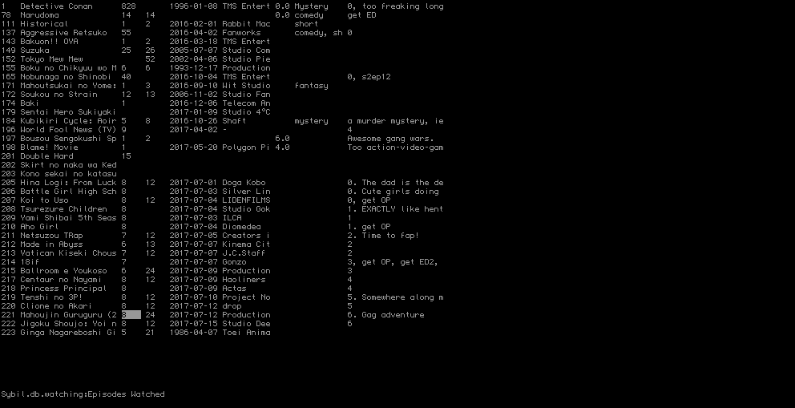
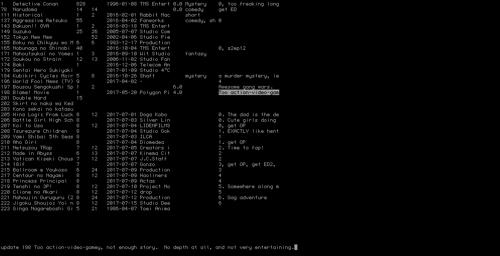

# About

This program is for maintaining a catalog of all the anime you've watched.  It's a frontend to the database created by aniData.  You can create tables that store different types of anime.  For example, you can make a table to store all the anime you've completed, another for the shows you've dropped, one for shows you plan to watch, etc.  It uses a command line interface with Vim-like keybindings.  Most tasks that you'll frequently do, such as switching among tables, inserting, copy-pasting, and removing entries, and modifying data can be done in very few keystrokes as in Vim.  Tab-completion of command names are also available.

# First time running

Before using the program, you need a proper SQLite database.  You can get one by using the anichart.sh program in the aniData repository.  This will give you databases for anime and hentai for a the years you specify.  Copy these to the directory that contains aniLog.py.

To start the app, change to the directory that contains aniLog.py and type the following command in the terminal:

```
    $ python aniLog.py
```

The python program must be that for python3.  Once you've started the program, type ':' to open the command line.  Type 'edit Sybil.db *' and hit enter.  This will display all tables of the Sybil database (Sybil is the default name for the anime database created by anichart.sh.  You can change it if you want).  At first, there will only be one table, but you can add more by typing 'clone tablename', where "tablename" is the name of the new table you want to create.  You can then access this table by typing 'edit Sybil.db tablename'.

There are nine columns in each table:

Index from the left | Name | Purpose
------------------- | ---- | -------
0 | id  | uniquely identify entries.  You'll probably never use this
1 | Name  | the name of the show
2 | Episodes Watched | the number of episodes you've watched
3 | Total Episodes | the number total number of episodes
4 | Date Aired | the date on which the show aired
5 | Production Studio | the animation studio
6 | Score | your score for the show
7 | Genres | the genres of the show
8 | Notes | any notes you have about the show

Most columns will be blank, such as Date Aired, Total Episodes, and Genres.  This is due to MAL not having the information available at the time that you used anichart.sh.

# Keybindings

Available keybinding are:
    j, k: move one row below, above.
    h, l: move one column left, right.
    q: quit the program
    yy: copy the current row or selected rows
    pp: paste a row or rows
    cc: put the contents of the current cell in the command line for editing
    C: open a blank command line for editing the current cell
    dd: remove the current row or the selected rows
    v: select the current row
    ++: increment the number of episodes watched by one.  This only works on the
      eps_watched column.
    /: search for entries using the current column.  For example, if you want to
      search for shows that aired in 2016, go to the date_aired column, hit '/',
      and type '2016'.
   gT, gt: go to the previous, next table
   i: insert a new row to the table
   ^, $: go to the first, last column
   gg, G: go to the first, last row
   ctrl-f, ctrl-b: scroll down, up by one page

Keybindings for the command line are:
   ctrl-p, up-arrow: go the previously entered command.
   ctrl-n, down-arrow: go the newly entered command.
   left-arrow: go the the left character.
   right-arrow: this is currently bugged and crashes the program.
   backspace: delete a character.
   enter, ctrl-j, ctrl-m: enter the command.
   tab: if the command line is empty, cycle through all available commands.  If not
     empty, cycle through all the commands that start with the currently entered
     command.

Available commands are:
   ls: show all open tables.  The tables are shown using an index for the table,
     followed by its name (database_name:tablename).
   b: switch to a table.  The argument to this can be a table name as shown in 'ls',
     its enumeration as shown in 'ls', or a regular expression for the table name.
   b#: switch to the previous table.  This has a bug that prevents it from being used
     consecutively.  Instead of using 'b#' 'b#' to go to the previous table and back
     again, you need to type 'b#' 'b #' (notice the added space).  When you use one
     version, the alternative version needs to be used the next time.  Otherwise, the
     table will not change.
   bd: close the current table.
   clone: create a new table.  The argument to this is the name of the new table.
   clone!: create a new table, overwriting an existing one with the same name.
   edit: open tables of a database.  The first argument to this is the database file
     to open, and the second argument is the name of a table in the database to open.
     To open all of the database's tables, the second argument can be '*'.
   mksession, ldsession: save the current session, load the most recently saved
     session.
   sort: sort the entries in the current table by the current column.  The argument
     should be 'asc' or 'desc' to sort in ascending or descending order, respectively.
     For example, to sort entries by decreasing air date, go to the date_aired
     column and enter 'sort desc'.  This is a little wonky, and should be mapped to a
     key, which will be done in the future.

# Screenshots

The 'ls' command shows you a list of all open tables at the bottom of the screen.  If more than one database is open, then the database name disambiguates common table names.


Selecting rows is done by pressing 'v'.  Pressing 'yy' or 'dd' will copy and delete the rows, respectively.  Pressing 'pp' after copying will paste the rows to the current table.


Pressing 'cc' on a column puts its text in the command line for you to edit.

